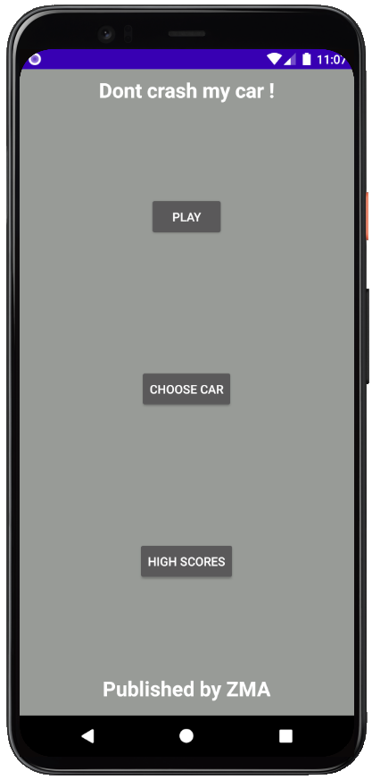
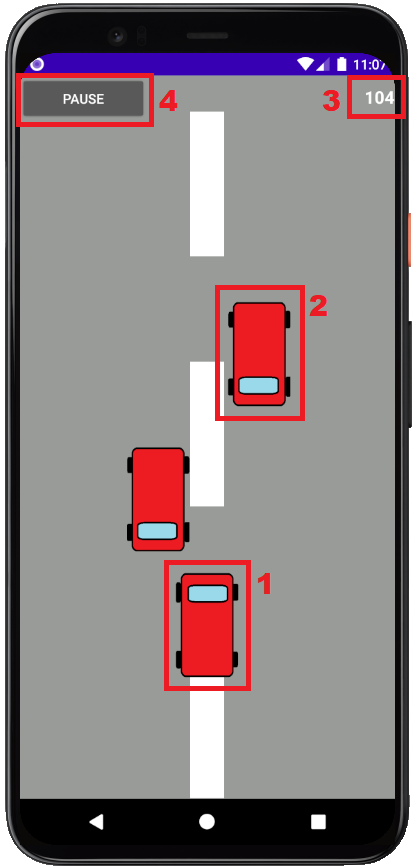

# Sumary
- [Introduction](#introduction)
- [Activities](#activities)
  - [MainActivity](#mainactivity)
  - [GameActivity](#gameactivity)
  - [ScoresActivity](#scoresactivity)
  - [CarChooserActivity](#carchooseractivity)
- [Intents](#intents)
- [Background services](#background-services)

# Introduction
*Don't crash my car* is a little runner type game (like temple run or subway surfers) where the player drive a car and try to avoid all the other ones. The game only ends when the player collides with another car, so the main goal for him is to have the biggest score. This game was made by 3 people :
* Aldric Vitali Silvestre <aldric.vitali@outlook.fr>
* Maxence Hennkein <maxence.hennekein@orange.fr>
* Zacharie Baril <add e-mail>

# Activities
**We have 4 activities that make up our app :**
- **MainActivity**, the main menu which permits to go to all other screens of the app.
- **GameActivity**, where the game really takes place.
- **ScoresActivity**, where player can see the 30 best scores that other players have obtained.
- **CarChooserActivity**, where the player can choose the appearance of the car that he wants to drive. He can only choose cars that he unlocked by having a sufficient score (stored in SharedPreferences).

### MainActivity
This activity contains only 3 buttons that permits to go to all others activities.
 

### GameActivity
This is where the game really takes place. On this activity, we have 4 main elements : 
  
1. salut

# Intents
To navigate through those activities, we need to use many intents.
* From the *MainActivity*, we have a basic (i.e empty) intent for going to the 3 others activities.
* From the *GameActivity*, we have an empty intent to go back to the MainActivity, and one for going to ScoresActivity that holds the score that the player has reach during his attempt.
* From the *ScoresActivity*, we have two empty intents : one for going to *MainActivity*, and the other one to go again to the *GameActivity*.
* From the *CarChooseActivity*, only one intent is needed, the one for going back to *MainActivity*

# Background services
We have one background service in our app : when *ScoreActivity* recieves the intent from *GameActivity* with the score, a service is started to check the score and store it in the database if needed (we only store the 30 best scores as a reminder), it will also check if the score is better than the one stored in the SharedPreferences (we store this score in order to check cars appearences that player can choose in the *CarChooseActivity*).
